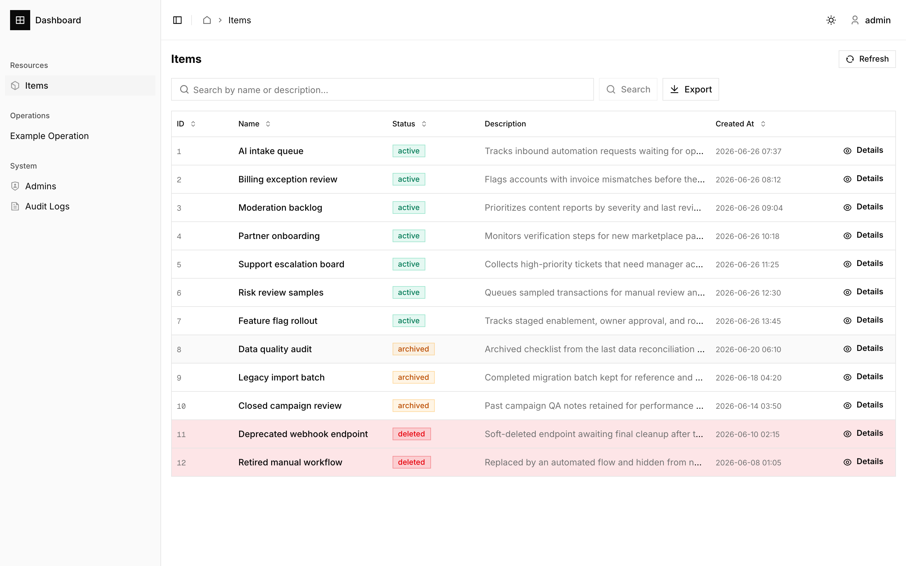

# AI Agent Native Admin Dashboard

Use this prompt to start work with any coding agent:

```text
You are working in this repository as an AI coding agent.

First read README.md, AGENTS.md, .rules.md, lib/dashboard-resources.ts, and lib/refine/server-data-provider.ts. Then read the relevant skill under .agents/skills for the task:

- dashboard-new-module: add a brand-new DB module.
- dashboard-refine-resource-workflow: add or modify resource pages.
- dashboard-refine-data-provider-wiring: wire a resource to a backend provider.
- dashboard-operations-page: add an admin write operation.
- dashboard-state-machine: add or update entity state visualization.

Follow the repository contracts:

- Use AGENTS.md and .rules.md as the source of coding rules.
- Register every resource in lib/dashboard-resources.ts.
- Route all CRUD data access through Refine data providers.
- Gate server mutations with requirePermission().
- Use only @/components/ui, components/refine-ui, and @remixicon/react.
- Use DryRunActionButton for write operations that need preview and confirmation.
- Prefer boring, incremental changes that match existing patterns.
- Add focused tests for changed behavior.
- Run pnpm format:check and pnpm check before saying the work is complete.

My task:
<paste the concrete dashboard feature, module, resource, operation, or fix here>
```

## Preview



This is an open-source admin dashboard template designed to be extended by AI coding agents without guessing the project shape. It gives agents explicit contracts for resources, permissions, data providers, operations, UI conventions, and validation gates.

If you are an AI agent: treat this README as the operating manual. Start here, then follow `.rules.md` and the local skills in `.agents/skills`.

## Agent Start Here

Before changing code, read these files in order:

1. `README.md` for the project contract.
2. `.rules.md` for UI and framework rules.
3. `lib/dashboard-resources.ts` for registered resources and routes.
4. `lib/refine/server-data-provider.ts` for backend provider dispatch.
5. The matching skill under `.agents/skills`.

Use these commands as the default validation sequence:

```bash
pnpm test
pnpm lint
pnpm typecheck
pnpm build
```

For final local verification, prefer:

```bash
pnpm format:check
pnpm check
```

Run commands sequentially. Do not run multiple `pnpm` validation commands concurrently in the same worktree.

## Agent Operating Contract

Always:

- Use `lib/dashboard-resources.ts` as the single source of truth for resource names, routes, sidebar groups, and permission metadata.
- Use Refine data providers for CRUD instead of hand-written page fetch logic.
- Use `@/components/ui` shadcn components and existing `components/refine-ui` wrappers.
- Use `@remixicon/react` icons only.
- Gate server mutations with `requirePermission()`.
- Add focused tests for pure behavior such as redirects, permission access, and operation semantics.
- Validate list, detail, create/edit, and operation pages in a browser when touching UI layout.

Never:

- Do not introduce another icon library.
- Do not bypass generic CRUD security checks.
- Do not add a resource page without registering it in `lib/dashboard-resources.ts`.
- Do not add a data provider without wiring it through `lib/refine/server-data-provider.ts`.
- Do not create operation pages that execute first and preview later.
- Do not leave TODOs, temporary plans, local DB files, or generated cache files in commits.

## What This Template Provides

- Authentication with signed HTTP-only cookie sessions.
- Permission-aware sidebar, Refine access control, and server-side permission enforcement.
- Generic admin CRUD endpoints under `/api/admin/[resource]`.
- Refine + TanStack Table list pages with search, sorting, pagination, and detail actions.
- Show/create/edit view wrappers for consistent admin page structure.
- Dry-run operation pattern with SQL preview and confirmation.
- Admin management, permission matrix, and audit logs.
- SQLite example module that runs locally with no external services.
- Agent skills for adding modules, resources, operations, and state badges consistently.

## Stack

| Layer       | Technology                                |
| ----------- | ----------------------------------------- |
| Framework   | Next.js 16 App Router, React 19           |
| Admin state | Refine 5, React Query 5, TanStack Table 8 |
| Data        | Drizzle ORM 0.45, SQLite example module   |
| UI          | shadcn/ui, Tailwind CSS 4                 |
| Icons       | `@remixicon/react` only                   |
| Auth        | Signed HTTP-only cookie session           |
| Tests       | Node test runner with `tsx`               |

## Quick Start

```bash
pnpm install
cp .env.example .env
pnpm db:push
pnpm db:seed
pnpm dev
```

Open `http://localhost:3000`.

Default accounts after seeding:

| Username   | Password      | Role                      |
| ---------- | ------------- | ------------------------- |
| `admin`    | `admin123`    | Superadmin                |
| `operator` | `operator123` | Read-only sample operator |

## Repository Map For Agents

```text
app/
  api/admin/[resource]/          Generic list/create API
  api/admin/[resource]/[id]/     Generic get/update/delete API
  api/admin/admins/[id]/permissions/
  dashboard/
    resources/                   List/show/create/edit resource pages
    operations/                  Dry-run operation pages
  login/
components/
  ui/                            shadcn primitives
  refine-ui/                     Refine wrappers for table and CRUD views
  operations/                    DryRunActionButton, SqlViewer
  entity-ui.tsx                  Detail grids, state badges, JSON, relation tables
db/
  example/                       SQLite schema, client, seed
lib/
  dashboard-resources.ts         Resource registry and navigation metadata
  refine/                        Client/server data providers
  permissions/                   Permission loading, checks, helpers
  operations/                    Shared operation helpers
tests/                           Node test runner regression tests
.rules.md                        Coding and UI rules
.agents/skills/                  Agent skills for repeatable dashboard changes
```

## Decision Tree

Adding a brand-new data domain?

- Use `dashboard-new-module`.
- Create `db/{module}/schema.ts` and `db/{module}/client.ts`.
- Add `lib/refine/{module}-data-provider.ts`.
- Register the module in `lib/refine/server-data-provider.ts`.

Adding a resource to an existing module?

- Use `dashboard-refine-resource-workflow`.
- Then use `dashboard-refine-data-provider-wiring`.
- Register the resource in `lib/dashboard-resources.ts`.
- Add list and show pages under `app/dashboard/resources/{kebab-name}`.

Adding a write operation?

- Use `dashboard-operations-page`.
- Put the page under `app/dashboard/operations/{operation}`.
- Use `DryRunActionButton`.
- Preview impact before execution.

Adding status/state UI?

- Use `dashboard-state-machine`.
- Add a state getter and tone map.
- Render state through `EntityStateBadge`.

## Core Contracts

### Resource Registry

`lib/dashboard-resources.ts` is the dashboard index. Every resource should define:

- `name`: Refine/API resource name.
- `module`: data provider module, such as `example`.
- `list`, `show`, `create`, `edit`: route templates.
- `group`: sidebar section.
- `permissionKey`: permission key such as `example.items`.
- `requiredAction`: default navigation action such as `read` or `update`.

This metadata powers Refine, sidebar navigation, permission-aware buttons, and breadcrumbs.

### Data Provider Contract

Generic CRUD routes call `getServerDataProvider(resource)` and then dispatch to the selected provider.

When adding a resource:

- The API resource name must match the provider allowlist.
- Filter and sorter fields must be allowed by schema metadata.
- Create/update/delete should return Refine-compatible `{ data }` responses.
- Custom write normalization belongs in the provider, not the page.

### Permission Contract

Server routes enforce permissions through `requirePermission()`. Client pages receive serialized permissions and wire them into Refine's `accessControlProvider`, so unauthorized navigation and buttons are hidden before interaction.

Permission keys use `<module>.<table_name>`:

```text
example.items
example.admins
example.audit_logs
```

### Operation Contract

Operation pages must be preview-first:

1. Validate inputs.
2. Build a plan in `onPrepare`.
3. Render affected records and SQL preview.
4. Execute in `onExecute` only after confirmation.

Use `variant="destructive"` only for irreversible operations. Reversible operations keep default confirmation styling.

## Common Agent Tasks

### Add A New Resource

1. Confirm the schema in `db/{module}/schema.ts`.
2. Add the resource to `lib/refine/{module}-data-provider.ts`.
3. Register it in `lib/dashboard-resources.ts`.
4. Add pages under `app/dashboard/resources/{kebab-name}`.
5. Add state/format helpers in `lib/{module}-records.ts` when needed.
6. Add a sidebar icon in `components/app-sidebar.tsx`.
7. Add or update tests for permission, redirect, or operation behavior.
8. Run `pnpm check`.

### Add A Dry-Run Operation

1. Create `app/dashboard/operations/{operation}/page.tsx`.
2. Add a resource-like entry to `lib/dashboard-resources.ts` with `group: "operations"`.
3. Gate the operation with the right permission action.
4. Implement `onPrepare`, `renderPlan`, and `onExecute`.
5. Add a pure helper test for destructive/default confirmation semantics when relevant.
6. Browser-test the operation page and confirmation dialog.

### Polish UI Across Pages

1. Prefer shared components in `components/entity-ui.tsx` or `components/refine-ui`.
2. Check all reused surfaces, not only the page that exposed the issue.
3. Validate desktop and mobile widths.
4. Check browser console errors for hydration or layout regressions.

## Scripts

```bash
pnpm dev           # Start Next.js with Turbopack
pnpm build         # Production build
pnpm start         # Start production server
pnpm lint          # ESLint 9 flat config + Next rules
pnpm typecheck     # TypeScript no-emit check
pnpm test          # Node test runner via tsx
pnpm check         # test + lint + typecheck + build
pnpm format        # Prettier write
pnpm format:check  # Prettier check
pnpm db:generate   # Generate Drizzle migrations
pnpm db:push       # Apply schema to local SQLite
pnpm db:seed       # Seed example data and admin users
pnpm db:studio     # Open Drizzle Studio
```

`pnpm-workspace.yaml` explicitly allows native build scripts required by `better-sqlite3`, `esbuild`, `sharp`, and `unrs-resolver` so CI/non-TTY installs do not stop at approval prompts.

## Environment Variables

```bash
DASHBOARD_SESSION_SECRET=change-me-in-production-must-be-at-least-32-chars
EXAMPLE_DB_PATH=./example.db
```

For production, replace the session secret with a high-entropy value and use a persistent database path or a real database module.

## Quality Gates

Before opening a PR or shipping generated code:

```bash
pnpm format:check
pnpm check
```

Manual smoke test checklist:

- Login redirects back to the intended dashboard path.
- Resource list renders with search, pagination, and row actions.
- Detail page renders without horizontal page overflow.
- Permission-gated navigation hides unauthorized sections.
- Operation page previews before executing.
- Browser console has no new hydration/runtime errors.

## Security Notes

- Sessions are signed and stored in HTTP-only cookies.
- Generic CRUD endpoints call `requirePermission()` before touching data providers.
- Filter and sorter fields are checked against Drizzle schema metadata.
- Admin password writes hash the plain `password` field and strip it before persistence.
- Audit logs record create/update/delete operations and permission changes.

This template is a starting point. Production deployments should add rate limiting, a CSRF strategy appropriate to your hosting setup, observability, backup policy, and organization-specific password/session rules.

## Contributing

1. Keep changes incremental.
2. Follow `.rules.md` and the local agent skills.
3. Add tests for behavior changes.
4. Run all quality gates.
5. Keep unrelated generated files and local database files out of commits.

## License

MIT. See `LICENSE`.
